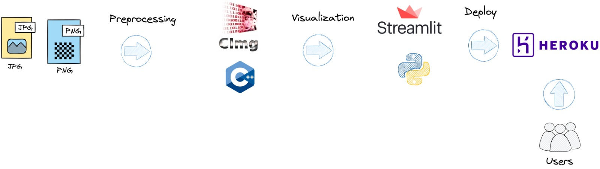
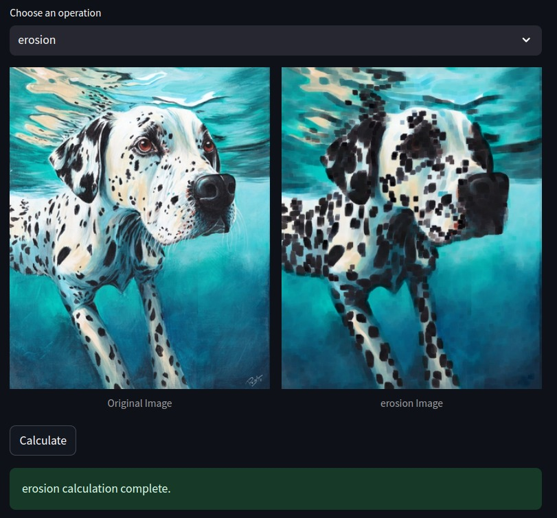

# CImg-Lab: Image Processing Application

### Overview

This project is an interactive image processing application that performs various operations such as gradient calculation, blur, mathematical transformations, and Kramer-Bruckner filtering on images. The application is built using C++ (with the CImg library for image processing) and provides a user-friendly interface using Streamlit, deployed on Heroku. Users can upload an image or use a default image to apply different processing techniques and view results in real-time.

<div align="center">
    
</div>

**Data Source**: Users can upload their own images or use a preloaded image (eagle.jpg) included in the application.

## Table of Contents
- [Project Features](#project-features)
- [Project Architecture](#project-architecture)
- [Technologies Used](#technologies-used)
- [Running the Application](#running-the-application)
- [Project Structure](#project-structure)
- [Usage Examples](#usage-examples)
- [Contact](#contact)

## Project Features

- **Image Processing Operations**: Offers multiple image processing options, including:
    - **Gradient Calculation**: Computes the gradient of an image to highlight edges.
    - **Gaussian Blur**: Applies a blur effect to soften the image.
    - **Mathematical Transformations**: Performs various mathematical operations, such as exponentiation and logarithmic transformations.
    - **Histogram Equalization for Contrast Adjustment**: Enhances image contrast by equalizing its histogram.
    - **Morphological Operations**: Includes common morphological operations:
        - **Erosion**: Reduces the size of bright regions to remove small white noise.
        - **Dilation**: Expands bright regions to fill gaps.
        - **Opening**: Erosion followed by dilation, useful for removing small objects.
        - **Closing**: Dilation followed by erosion, useful for closing small holes in regions.
    - **Kramer-Bruckner Filter**: Enhances edges by combining morphological erosion and dilation.

- **Interactive Interface**: Displays original and processed images side by side within an interactive Streamlit application, allowing users to visually compare results in real-time.


## Project Architecture

Below is the high-level architecture of the project, covering image upload, processing, and result visualization stages.

<div align="center">  </div>


1. **Image Upload**: Users can upload their images or select a default image.
2. **Image Processing**: Applies various image processing algorithms using C++ and the CImg library.
3. **Result Visualization**: Displays the original and processed images side by side within a Streamlit interface.
4. **Deployment**: Hosted on Heroku for easy access and scalability.
---

## Technologies Used

- **C++**: Core programming language for image processing algorithms.
- **CImg Library**: Provides image manipulation and processing capabilities in C++.
- **Streamlit**: Used for creating a web-based interactive application.
- **Python**: Interfaces the C++ processing code with Streamlit.
- **Heroku**: Platform for deploying and running the application online.
- **Pillow (PIL)**: For handling images in the Streamlit app.

## Running the Application

1. **Clone the Repository**:
    - First, clone the repository to your local machine:
      ```bash
      git clone https://github.com/Carlos93U/cimg_lab.git
      cd cimg-lab
      ```

2. **Install Dependencies**:
    - Install the required dependencies using `requirements.txt`:
      ```bash
      pip install -r requirements.txt
      ```

3. **Run the Streamlit Application**:
    - Start the app locally:
      ```bash
      streamlit run main.py
      ```
    - Access the application in your web browser at `http://localhost:8501`.


## Project Structure

The following is an overview of the main folders and files within the project.

```plaintext
cimg-lab/
│
├── bin/                        # Contains the C++ executable
│
├── data/                       # Stores input and output images
│   ├── input/                  # Directory for input images
│   │   └── eagle.jpg           # Default input image
│   └── output/                 # Directory for output images
├── docs/                       # gifs and images for docs
│
├── include/                    # CImg library and headers
│
├── src/                        # Source code for image processing algorithms     
│   └── main.cpp                # Main C++ file for processing operations
│
├── app.py                      # Streamlit application code
├── requirements.txt            # List of dependencies
├── README.md                   # Project documentation
└── LICENSE                     # License for the project
```

## Usage Examples

### Image Processing

The application allows users to perform various image processing operations on uploaded images or the default image. Users can select the type of processing (e.g., gradient, blur, Kramer filter) and view the original and processed images side by side.

<div align="center">  </div>

## Deploying on Heroku

To deploy this application on Heroku, follow these steps:

1. **Login to Heroku**:
   ```bash
   heroku login

2. **Add Heroku Remote**:  
   Link your local Git repository to the Heroku app. Replace `cimg-lab` with the actual name of your Heroku application.
   ```bash
   heroku git:remote -a cimg-lab*

3. **Commit and Push Changes to GitHub**:  
   Stage, commit, and push your changes to the main branch of your GitHub repository.
   ```bash
   git add .
   git commit -m "Description of changes"
   git push origin main

4. **Deploy to Heroku**:  
   Push the main branch to Heroku to deploy the application.
   ```bash
   git push heroku main

6. **View Heroku Logs (optional)**:  
   To troubleshoot or view runtime logs, use the following command:
   ```bash
   heroku logs --tail

## Contact

For any questions or feedback, please contact:

**Juan C. Huillcas**  
Email: [huillcas.juan3@gmail.com](mailto:huillcas.juan3@gmail.com)  
LinkedIn: [Juan C. Huillcas](https://www.linkedin.com/in/juan-carlos-huillcas)

---